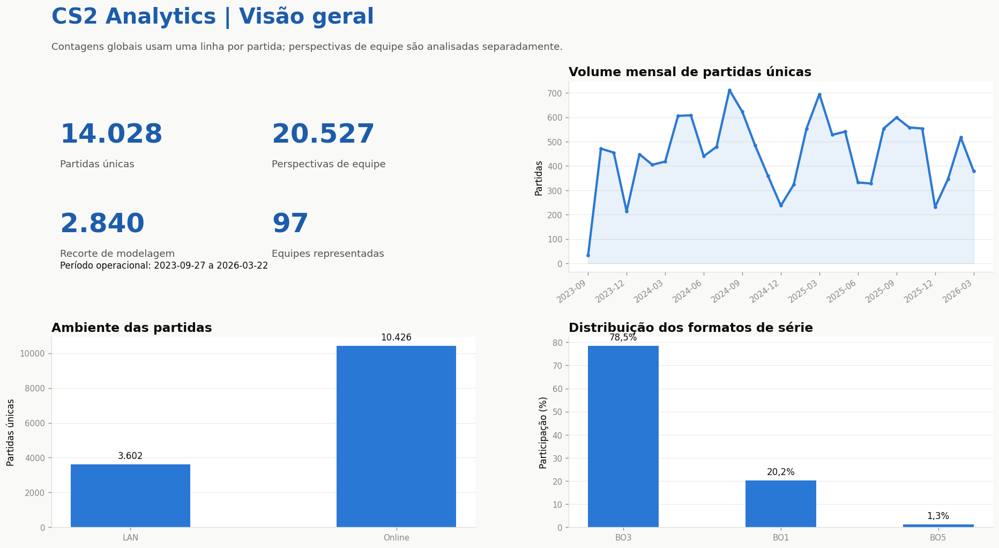
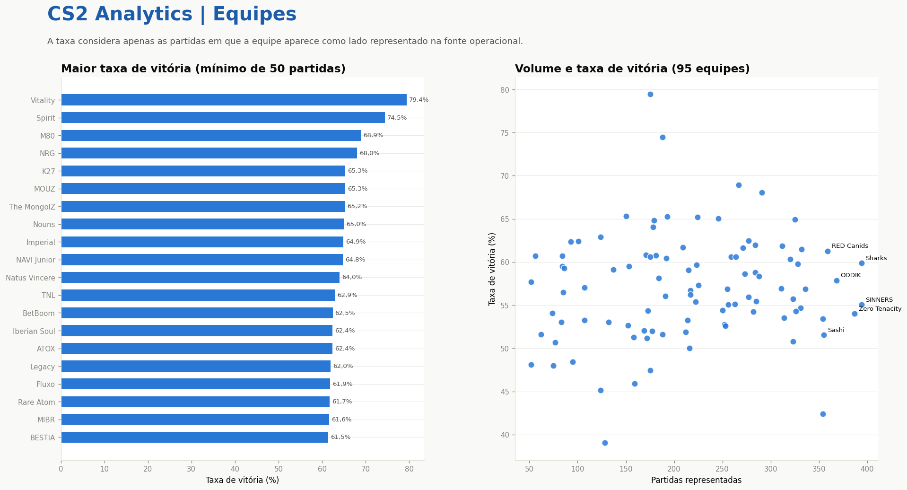
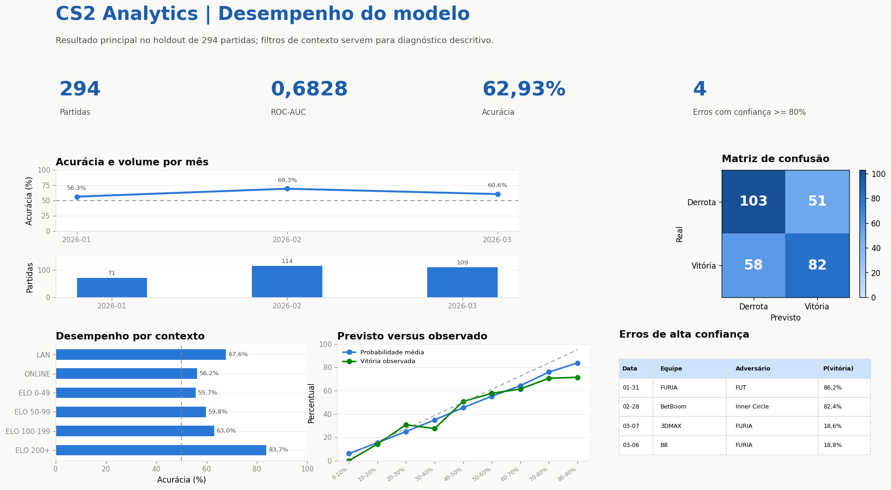

# CS2 Analytics: Python, SQL e Power BI

[](https://github.com/ceegu1N/cs2-analytics/actions/workflows/tests.yml)

[Abrir dashboard interativo](https://ceegu1n.github.io/cs2-analytics/)

Extensão analítica de um TCC sobre predição pré-jogo de partidas profissionais de Counter-Strike 2. O projeto reorganiza bases consolidadas em um banco SQLite, responde perguntas com SQL e entrega dashboards em HTML e Power BI.

O foco deste repositório é o **fluxo de análise de dados**. O modelo preditivo permanece congelado e não é retreinado pelo dashboard.

## Entregas

- banco relacional SQLite reconstruído por Python;
- esquema com dimensões, fatos, chaves e verificações de integridade;
- nove consultas SQL sobre equipes, tempo, ambiente, formatos, confrontos e ELO;
- cinco páginas de dashboard estático e um dashboard HTML interativo com tema escuro/claro;
- projeto Power BI versionável em formato PBIP/PBIR;
- previsões congeladas do holdout para análise do desempenho do modelo;
- 20 testes automatizados de dados, consultas, métricas, imagens e portabilidade.

## Visão do dashboard







O painel HTML tem tema escuro/claro, tooltips em todos os gráficos e uma visão em tabela por gráfico. Na dispersão de equipes, o cursor identifica qualquer uma das 95 equipes com pelo menos 50 registros e mostra nome, volume, vitórias, derrotas e taxa de vitória.

## Arquitetura

```text
CSVs consolidados + modelo congelado
                  |
                  v
        validação e transformação em Python
                  |
                  v
       SQLite: dimensões + tabelas fato
                  |
        +---------+----------+
        |                    |
        v                    v
  consultas SQL       tabelas para Power BI
        |                    |
        v                    v
 resultados CSV      relatório com 5 páginas
        |
        v
 dashboard HTML/PNG + conclusões
```

A arquitetura, o modelo de dados e a operação dos dashboards estão resumidos na [documentação técnica](docs/DOCUMENTACAO_TECNICA.md). As principais fórmulas do Power BI estão no [catálogo de medidas DAX](power_bi/medidas_dax.md).

## Tecnologias

- Python 3.12;
- pandas, NumPy, joblib e scikit-learn;
- SQLite e SQL;
- Matplotlib e SVG interativo gerado em Python;
- Power BI, Power Query e DAX;
- unittest e GitHub Actions.

## Como executar

No PowerShell:

```powershell
git clone https://github.com/ceegu1N/cs2-analytics.git
cd cs2-analytics
python -m venv .venv
.\.venv\Scripts\Activate.ps1
python -m pip install -r requirements.txt
python run_all.py --rebuild
```

O comando:

1. valida os arquivos de entrada;
2. recria `output/cs2_analytics.sqlite`;
3. executa e exporta as nove consultas;
4. gera as seis tabelas consumidas pelo Power BI;
5. atualiza automaticamente o caminho `DataRoot` do projeto Power BI;
6. gera cinco imagens, o dashboard HTML e conclusões não técnicas.

Depois, abra:

- `output/dashboard/index.html` para o painel HTML;
- `power_bi/CS2_Analytics.pbip` para o relatório no Power BI Desktop.

## Consultas SQL

Liste as consultas disponíveis:

```powershell
python run_query.py --list
```

Execute uma consulta:

```powershell
python run_query.py 02_desempenho_equipes.sql --limit 10
```

Exemplo do recorte analítico de equipes:

```sql
SELECT
    t.team_name AS equipe,
    COUNT(*) AS partidas_representadas,
    ROUND(AVG(f.win), 4) AS taxa_vitoria
FROM fact_team_match AS f
JOIN dim_team AS t ON t.team_id = f.team_id
GROUP BY t.team_id, t.team_name
HAVING COUNT(*) >= 50
ORDER BY taxa_vitoria DESC;
```

## Granularidade dos dados

- `fact_team_match`: 20.527 perspectivas de equipe; uma partida pode aparecer por mais de uma equipe.
- `fact_match`: 14.028 partidas únicas.
- `fact_model_match`: 2.840 partidas do recorte experimental com 38 atributos pré-jogo.
- `fact_prediction_holdout`: 294 previsões do holdout feitas pelo modelo final congelado.

Essa distinção evita o erro de contar perspectivas de equipe como se fossem partidas únicas.

## Testes

```powershell
python -m unittest discover -s tests -v
```

Os testes conferem chaves, granularidade, integridade referencial, execução das consultas, reprodução das métricas do holdout, geração dos dashboards e configuração portátil do Power BI.

## Origem e limites

Os dados consolidados derivam de páginas públicas da HLTV.org e foram preparados no contexto acadêmico do TCC. Os scripts de coleta não fazem parte deste repositório. A identidade dos mapas e os vetos não estão disponíveis nesta base, portanto o projeto não apresenta análises por mapa.

Este repositório não possui vínculo com a HLTV.org e não deve ser interpretado como sistema de apostas ou garantia de resultado.

A licença MIT cobre o código autoral. Os dados preservam sua origem e estão sujeitos às condições descritas em [Dados utilizados](data/README.md) e no [aviso de atribuição](NOTICE.md).

## Autor

Gabriel Herdy Rocha<br>
Engenharia de Computação, UFSCar<br>
[LinkedIn](https://www.linkedin.com/in/gabriel-herdy/) | [GitHub](https://github.com/ceegu1N)
